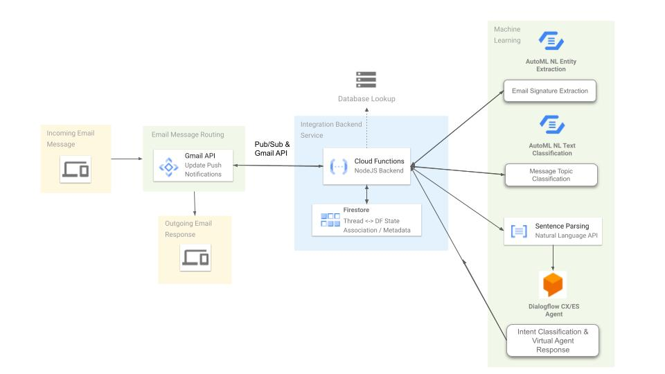

# Enable Email Communication with a Dialogflow CX Agent

In this tutorial, you will learn how to configure Google Cloud services for email communication with a Dialogflow CX Agent. 

This solution leverages Gmail API Push Notifications to watch a Gmail or Google Workspace inbox that has been created as an email receiver for your Dialogflow CX agent. You will deploy a Cloud Function to handle communication between Gmail & Dialogflow, and Pub/Sub will be configured to trigger the Cloud Function when new emails arrive. Cloud Firebase in Datastore Mode will store information related to messages, conversation threads, and corresponding Dialogflow sessions.



### GCP Services to be Configured
- Cloud Pub/Sub
- Gmail API Push Notifications
- Cloud Scheduler 
- Cloud Functions (NodeJs)
- Cloud Firestore in Datastore Mode
- Dialogflow CX
- AutoML Natural Language - Entity Extraction
- AutoML Natural Language - Text Classification
- Natural Language API


## Create a GCP Project 
[Create a new GCP Project](https://cloud.google.com/resource-manager/docs/creating-managing-projects) or use an existing project that contains the Dialogflow CX Agent to be enabled for email conversations. For this tutorial, an agent export is available in this repository that you can upload to Dialogflow CX.

## Enable Google Cloud APIs
Enable the following APIs in your project.
- Cloud Functions API
- Cloud Build API

## Download the Application Code 
Cloud Shell provides you command-line access to your Google Cloud Platform resources directly from your browser. You can use Cloud Shell to execute the terminal commands required to deploy this solution.

To open Google Cloud Shell, click the Activate Cloud Shell button on the top blue horizontal bar. A new panel will appear at the bottom of the screen:
<br><br>
<br><br>

Run the command below in your Cloud Shell to clone the project:
```
git clone https://github.com/GoogleCloudPlatform/dialogflow-email-agent-demo.git
```

## Restore Dialogflow CX Demo Support Agent
First, create a new Dialogflow CX agent by following the instructions here: [Create an Agent](https://cloud.google.com/dialogflow/cx/docs/concept/agent#create). Then, follow the instructions to [restore an agent](https://cloud.google.com/dialogflow/cx/docs/concept/agent#export) using the agent export available in this repository: dialogflow-support-agent.blob. Name the agent something like "GCP Support Agent" and leave the defaults, using us-central1 as the location. Cloud Shell will allows you download files - you can use this feature to download dialogflow-support-agent.blob and upload into Dialogflow CX.

This is what the agent should look like after restore from dialogflow-support-agent.blob.
<br><br>


## Train ML Models Using AutoML Naturual Language

### Email Signature Extraction
The [BC3: British Columbia Conversation Corpora](https://www.cs.ubc.ca/cs-research/lci/research-groups/natural-language-processing/bc3.html) is a public dataset of emails containing signatures that we can use to train a basic machine learning model for email signature extraction. This model is for demo purposes only - ideally there would be a larger quantity of training data to improve the signature recognition capability. We've already prepared annotated training data in a format that AutoML Natural Language Entity Extraction will accept. Learn more more about preparing data for AutoML [here](https://cloud.google.com/vertex-ai/docs/datasets/prepare-text?&_ga=2.173129635.-1491934205.1627495235#entity-extraction). 

If you would like to create your own jsonl file using the raw .xml file provided by the University of British Columbia, you can follow along with the Colab Notebook included in this respository: [Training_Data_for_Signature_Extraction.ipynb](http://colab.research.google.com/github/). Once you have the .jsonl file uploaded to AutoML, you will need to use AutoML to annotate all of the signatures in the dataset or submit a data labeling request.

Otherwise, continue with the instructions to use the annotated data we have provided for you. 

1. Create a storage bucket and upload the email signature training data to Cloud Storage using the following commands.
```
export BUCKET_NAME=new-storage-bucket-name
cd dialogflow-email-agent-demo
unzip bc3_annotated_email_data.zip
sed "s/your-storage-bucket/$BUCKET_NAME/g" ./bc3_annotated_email_data/text_extraction_template.csv > ./bc3_annotated_email_data/text_extraction.csv
gsutil mb gs://$BUCKET_NAME
gsutil -m cp -r bc3_annotated_email_data gs://$BUCKET_NAME/bc3_annotated_email_data
```

2. Navigate to *Natural Language > AutoML Entity Extraction > Get Started* using the Cloud Console navigation menu.
<br><br>

3. Create a new dataset with a name like *bc3_email_data* for AutoML Entity Extraction. Select the *bc3_annotated_email_data/text_extraction.csv* file in the cloud storage location from the step above to import the training data. The csv file points to the individual jsonl files that were also uploaded to the cloud storage bucket.
<br><br>
<br>

4. Once the dataset has been created, navigate to the Train tab and train a new model. Leave the box checked to deploy the model after training finishes.
<br><br>

5. When training completes, you will be able to test and deploy the model for integration into our email application using the Test & Deploy tab.

### Email Topic Classification
Next we'll train a model in your project to classify emails and determine which GCP products and services are relevant to the questions asked by our users. This is safe to do while the entity extraction model above is training. Training can take up to an hour to complete. Google Cloud provides [public datasets](https://cloud.google.com/bigquery/public-data) that can be used to create training datasets for some problems. We'll use the public StackOverflow dataset filtered on posts with Google or Dialogflow in the tag. These set of posts are similar in nature to support emails that we might receive for Google Cloud products and services. 

If you would like to see how our training data was formated for AutoML Natural Language, you can follow along with the Colab Notebook included in this repository: [StackOverflow_Topic_Classification.ipynb](http://colab.research.google.com/github/). Labels that have less than 100 items will need to be removed.

Otherwise, continue with the instructions to use the prelabeled dataset that we exported from our demo environment.

1. Create a storage bucket and upload the StackOverflow training data to Cloud Storage using the following commands.
```
export BUCKET_NAME=new-storage-bucket-name
cd dialogflow-email-agent-demo
unzip stackoverflow_train_data.zip
sed "s/your-storage-bucket/$BUCKET_NAME/g" ./stackoverflow_train_data/text_classification_template.csv > ./stackoverflow_train_data/text_classification.csv
gsutil mb -l us-central1 gs://$BUCKET_NAME
gsutil -m cp -r stackoverflow_train_data gs://$BUCKET_NAME/stackoverflow_train_data
```

2. Navigate to *Natural Language > AutoML Text & Document Classification* using the Cloud Console navigation menu. Create a new dataset for Multi-label Classification and give it a name like *stackoverflow_topic_classifier*.
<br><br>

3. Import the training data by browsing to the *text_classification.csv* file in the storage bucket that you created in the prior step.
<br><br>

4. Once the data has been imported, navigate to the Train tab and train a new model. Leave the box checked to deploy the model after training finishes.
<br><br>

5. When training completes, you will be able to test and deploy the model for integration into our email application using the Test & Deploy tab.


## Configure Pub/Sub and Gmail Push Notifications

### Create a PubSub Topic
In this section, you will create a PubSub Topic to receive the Gmail API Push Notifications.

1. In your GCP Project, use the Navigation menu to locate Pub/Sub and create a new Topic. For this tutorial, we’ll use gmail-inbox-watch. Uncheck the box to “Add a default subscription.” You’ll create a subscription for Cloud Functions in a later step.
<br><br>

2. Additionally, you must give the Gmail API permission to send messages to your Pub/Sub topic: click the context menu of the topic you just create (three vertical dots), and choose View permissions.
<br><br>


3. Click Add members, specify gmail-api-push@system.gserviceaccount.com as a new member, and give it the role of Pub/Sub > Pub/Sub Publisher; lastly, click Save to apply the changes.
<br><br>


### Create or Use Existing Gmail or Google Workspace Account
Create or use an existing [Gmail](https://support.google.com/mail/answer/56256?hl=en) or [Google Workspace account](https://support.google.com/a/answer/33310?hl=en) to act on behalf of our Dialogflow CX Agent. Users will communicate with our agent by sending an email to this address, and our application will send a response using this account and the Gmail API.

In the next section, you will see how to configure access for the application to this Gmail or Google Workspace account inbox.


### Enable Gmail API & Create an OAuth 2.0 Client
In this section, you will enable the Gmail API in your GCP Project, create an OAuth 2.0 client, and configure Gmail Push Notifications against your receiving inbox for Dialogflow CX integration. This tutorial leverages some of the steps outlined in [Implementing Server-Side Authorization](https://developers.google.com/gmail/api/auth/web-server) and [Push Notifications](https://developers.google.com/gmail/api/guides/push).

To get started using Gmail API, you need to enable the API and create credentials for the application.

1. Select your GCP Project in the first window. 

2. Navigate to APIs & Services > Credentials and select "Create Credentials" and "Help Me Choose" to create OAuth 2.0 credentials. Specify the Gmail API and User Data to create an OAuth 2.0 Client. Then, click Next.
<br><br>

3. In the next screen, give your App a name and provide a support email address and developer contact address.
<br><br>

4. In the next screen, continue without defining Scopes. Scopes will be defined in the application code when authorization is requested.

5. Next, select Desktop app as the Application Type and give it a name like “Desktop Authorization App.” 
<br><br>
**Note:** In this example, we perform 2 one-time authorizations locally to create the access & refresh tokens, which will be included in our deployments to GCP. One authorization is for a Python Scheduled Task that will renew the Gmail Push Notification & Pub/Sub integration daily. The second authorization is for the NodeJs app that will be parsing & sending emails on behalf of your Dialogflow CX agent. 
<br><br>
Only the one-time authorizations are needed to establish the connection between your Gmail or Google Workspace inbox for the application unless access scopes are changed or the OAuth Client Id changes.
<br><br>

6. Next, click Download to save the OAuth client secret for use in a later step. Then click Done.
<br><br>


### Enable Gmail Push Notifications
In this section, you will execute a Python script locally to generate an access token for the Gmail API and enable Gmail Push Notifications to the Pub/Sub Topic created earlier.

1. Locate the Oauth client secrets file downloaded in the prior step and upload the file to Cloud Shell.
<br><br>

2. The file will have been uploaded to your home directory in Cloud Shell. Let’s rename the file and move it to the working directory for this section with the following command.
```
cp ~/client_secret_*.apps.googleusercontent.com.json ~/dialogflow-email-integration/enable_push_notifications/client_credentials.json
```

3. Next, open the Cloud Shell Editor and the file dialogflow-email-integration/enable_push_notifications/config.yaml. Update GMAIL_ID with the email address for the Gmail or Google Workspace inbox you will use for Dialogflow integration. Save the change and return to the Cloud Shell Terminal.
<br><br>

4. Run the following commands to authorize the Gmail API and enable Push Notifications to Pub/Sub. Follow the prompts to allow access to the email account specified.
```
cd ~/dialogflow-email-agent-demo/gmail_push_notifications
pip3 install -r requirements.txt
export GCP_PROJECT=your-project-id
export PUBSUB_TOPIC=gmail-inbox-watch
export GMAIL_ID=your-dialogflow-inbox@gmail.com
python3 -c 'import main; main.main()'
```
<br><br><br><br>
A response like the following shows that we are successful. Notice that a token.json was stored in the working directory. This contains the refresh token for our server-side application.
<br><br>

5. This inbox push notifications we configured will expire in 7 days. Next, let’s deploy this script as a Cloud Function that Cloud Scheduler can execute daily to renew the inbox watch for Pub/Sub.
```
cd ~/dialogflow-email-agent-demo/gmail_push_notifications
gcloud functions deploy renew-gmail-watch --entry-point main --runtime python39 --trigger-topic renew-gmail-watch --env-vars-file config.yaml --project your-project-id
```

6. Navigate to Cloud Scheduler and create a new job. Choose a location based on your needs, a daily frequency (the screenshot belows shows daily at 1am CDT).
<br><br>

7. Configure the following attributes as shown in the screenshot below.
<br><br>

8. Configure advanced settings and deploy.
<br><br>


## Deploy a NodeJS Email Integration Service
Finally we'll deploy a NodeJS application using Cloud Functions that will handle processing of emails between Dialogflow and Gmail. The source code for the NodeJS integration service can be found in ~/dialogflow-email-agent-demo/df_integration_service.

1. First, run the following command to copy the OAuth client credentials into this directory, which will be used to generate a token for the Gmail API.
```
cp ~/client_secret_*.apps.googleusercontent.com.json ~/dialogflow-email-agent-demo/df_integration_service/credentials.json
```

2. Update ~/dialogflow-email-agent-demo/df_integration_service/config.yaml with the appropriate values using the Cloud Shell Editor. Here is an explanation of the variables that need to be populated.
- GMAIL_ID: The email address of the agent / support gmail inbox.
- GCP_PROJECT: Your GCP project id.
- LOCATION: The location of the agent which can be found in the Dialogflow CX console. ex. us-central1
- AGENT_ID: The id of your agent which can be found in the Dialogflow CX console.
- SUBJECT_KEY: The subject that a user needs to use in order for a response to be sent from the application. This prevents unwanted emails from being sent by our application.
- ENTITY_EXTRACT_MODEL_ID: The id of the entity extraction model which can be found in the AutoML Natural Language console for the deployed model.
- TOPIC_CLASSIFY_MODEL_ID: The id of the topic classification model which can be found in the AutoML Natural Language console for the deployed model.

3. Next, execute the following commands to generate the access token. If the token.json file has been generated then you are ready to deploy.
```
cd ~/dialogflow-email-agent-demo/df_integration_service/

export GMAIL_ID=your-agent-email@gmail.com
export GCP_PROJECT=your-project-id
export LOCATION=us-central1

npm install
node
const SCOPES = ['https://www.googleapis.com/auth/gmail.readonly', 'https://www.googleapis.com/auth/gmail.compose'];
var gmailHelper = require('./gmail_auth_helper.js');
const gmail = gmailHelper.newClient('credentials.json', SCOPES);
```

5. Finally, execute the following to deploy the Cloud Function.
```
gcloud functions deploy main --runtime=nodejs14 --trigger-topic=gmail-inbox-watch --env-vars-file=config.yaml --project=$GCP_PROJECT
```

## Upload Knowledgebase of Reference Links
When our AutoML model discovers relevant GCP products within the incoming email, we can lookup reference materials for these products using Cloud Firestore in Database Mode. An exported Datastore entity has been included with the repository for upload to Cloud Datastore to simiplify setup of this demo.

1. First, upload the demo knowledge base to Cloud Storage.
```
export BUCKET_NAME=new-storage-bucket-name
cd edialogflow-email-agent-demo
unzip datastore-knowledgebase.zip
gsutil mb -l us-central1 gs://$BUCKET_NAME
gsutil -m cp -r datastore-knowledgebase gs://$BUCKET_NAME/datastore-knowledgebase
```

2. Next, navigate to Datastore from the console navigation menu. Use the Import/Exprot pane to import the knowledgebase data that you uploaded to Cloud Storage in the prior step. Specify **knowledgeBase** as the Datastore Kind when performing this import. See the screenshot below.
<br><br>


## Test the Application
1. Send an email to your agent email address with the subject that you specified as the "SUBJECT_KEY" in the section above. Try the following message:

Hi,

I'm having problems with an App Engine service and Cloud Storage bucket. My application isn't authenticating users correctly. I'd also like to cancel a prior request that I had created. 

Thanks,
Greg

2. The agent should respond with something like...
<br><br>


3. Provide a reference number for the request to cancel.

I'd like to cancel request #123456.

Best,
Greg

4. The final response from the agent will look something like this.
<br><br>


## References

Ulrich J., Murray G., Carenini G., A Publicly Available Annotated Corpus for Supervised Email Summarization AAAI08 EMAIL Workshop, Chicago, USA, 2008. [pdf] [bib]